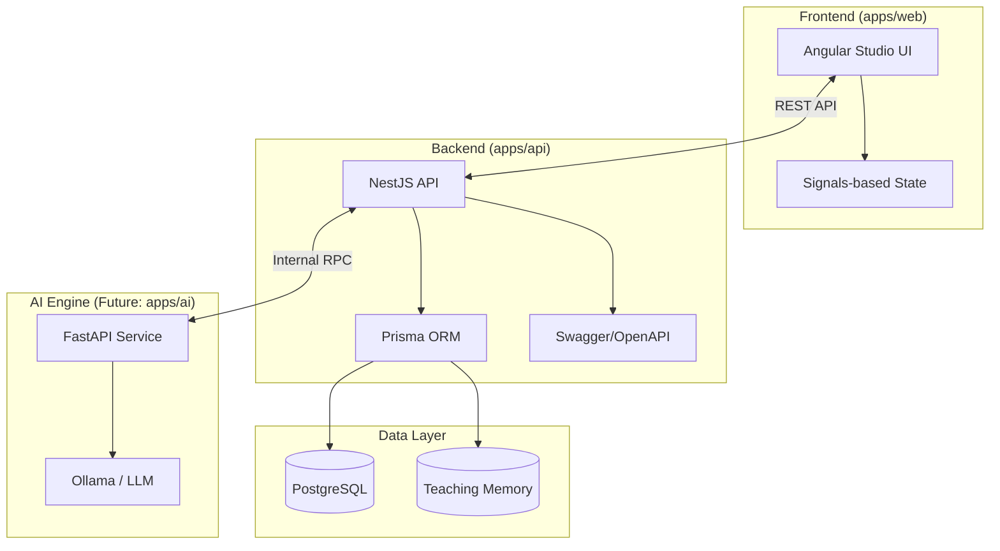
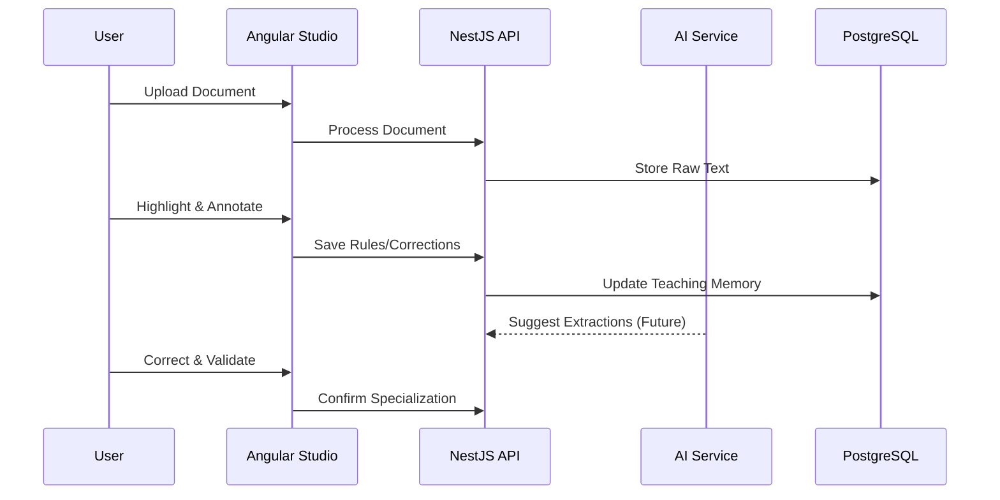

# TaskMindAI

[](https://nx.dev)
[](https://angular.dev)
[](https://nestjs.com)
[](https://prisma.io)

> **Collaborative AI teaching and specialization platform.**

TaskMindAI empowers humans to teach operational workflows to AI through interaction, annotations, and structured rules. Unlike generic chatbots, TaskMindAI focuses on **applicability-aware specialization**, where the system learns not just how to extract data, but *when* it should apply its reasoning.

---

## 🏗 System Architecture

The project is managed as an **Nx Monorepo**, ensuring high-quality standards, shared contracts, and efficient task execution.



---

## ✨ Product Workflow: Document Studio (MVP 0)

Our primary focus is the **Document Studio**, where humans specialize the AI's understanding of complex documents.



---

## 🛠 Tech Stack

| Layer | Technology |
| :--- | :--- |
| **Monorepo** | [Nx](https://nx.dev) |
| **Frontend** | [Angular](https://angular.dev) (Signals, SCSS BEM) |
| **Backend** | [NestJS](https://nestjs.com) (REST, Swagger) |
| **Database** | [PostgreSQL](https://www.postgresql.org/) + [Prisma](https://prisma.io/) |
| **Containerization** | [Docker Compose](https://docs.docker.com/compose/) |
| **AI Strategy** | [Ollama](https://ollama.com/) (Local LLM) |

---

## 🏁 Getting Started

### Prerequisites

- [Node.js](https://nodejs.org/) (LTS)
- [Docker Desktop](https://www.docker.com/products/docker-desktop/)
- [Nx CLI](https://nx.dev/getting-started/installation) (Optional, `npm exec nx` is used locally)

### 1. Environment Setup

Copy the example environment file:

```bash
cp .env.example .env
```

### 2. Infrastructure

Start the local PostgreSQL database:

```bash
docker compose -f docker-compose.dev.yml up -d postgres
```

### 3. Database Migration

Initialize the database and generate the Prisma client:

```bash
# Generate Prisma Client
npm exec nx generate-client api

# Apply Migrations
npm exec nx migrate-dev api
```

### 4. Development Servers

Launch the frontend and backend in parallel:

```bash
# Start API
npm exec nx serve api

# Start Web Studio
npm exec nx serve web
```

---

## 📂 Repository Structure

```text
├── apps/
│   ├── web/          # Angular frontend (Document Studio)
│   ├── api/          # NestJS backend (REST API)
│   └── ai/           # (Planned) FastAPI service for AI logic
├── libs/
│   ├── shared/       # Common DTOs and domain types
│   ├── ui/           # Reusable Angular components
│   └── config/       # Shared environment & config helpers
├── prisma/           # Schema definitions and migrations
├── docker/           # Container configurations
└── docs/             # Product & Architecture documentation
```

---

## 🎯 MVP 0 Roadmap & Constraints

### In-Scope (Document Studio)
- ✅ Workspace & Document Management
- ✅ Text Parsing & Selection Logic
- ✅ Manual Annotations & Operational Rules
- ✅ Teaching Memory (Correction Loops)
- ✅ Applicability-Aware Logic (Graceful Failure)

### Non-Goals for MVP 0
- ❌ Authentication / User Accounts
- ❌ OCR (Optical Character Recognition)
- ❌ RAG (Retrieval-Augmented Generation)
- ❌ LLM Fine-tuning
- ❌ Real-time WebSockets

---

## 🤝 Contributing

We welcome contributions! Please see our [CONTRIBUTING.md](./CONTRIBUTING.md) for guidelines on our development workflow and coding standards.

## 📄 License

This project is proprietary and confidential. See LICENSE for details (if applicable).
